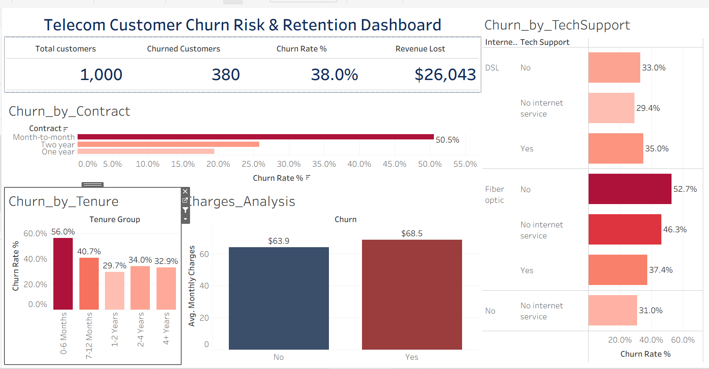

# Telecom Customer Churn Risk & Revenue Retention Analysis

> An end-to-end data analytics project uncovering the behavioral drivers of customer churn across 1,000 audited subscriber accounts, modeling **$312,516 in annualized revenue exposure**, and designing an actionable retention roadmap in Tableau Public.

## Executive Summary

Customer attrition is not simply a metric — it directly degrades recurring cash flow. In this project, an audited dataset of **1,000 telecommunications subscribers** was cleaned and reconciled using Microsoft Excel and SQL, followed by exploratory analysis and interactive dashboard development in Tableau Public.

The analysis revealed an aggregate **churn rate of 38.0%** (380 churned accounts), placing **$26,043 in Monthly Recurring Revenue (MRR)** and **$312,516 in Annualized Revenue** at immediate risk. 

Rather than a uniform distribution, churn is heavily concentrated in three structural risk zones:
1. **Contract Type:** Month-to-Month accounts churn at **50.5%**, representing 73.7% of all lost subscribers.
2. **Tenure Onboarding Cliff:** Customers in their first 6 months experience a **56.0% churn rate**.
3. **Unsupported Fiber Lines:** Fiber Optic subscribers without technical assistance churn at **52.7%**, compared to **37.4%** for those with Tech Support (a **15.3% retention advantage**).

## Executive KPI Scorecard

All metrics reflect the verified baseline of 1,000 audited customer records:

| Metric | Calculation / Definition | Baseline Value | Business Interpretation |
| :--- | :--- | :---: | :--- |
| **Total Customers** | `COUNTD(Customer_ID)` | **1,000** | Audited active subscriber cohort |
| **Retained Customers** | `COUNTD(IF Churn = 'No')` | **620** | Retained subscriber base (62.0%) |
| **Churned Customers** | `COUNTD(IF Churn = 'Yes')` | **380** | Canceled / disconnected accounts |
| **Aggregate Churn Rate** | `380 / 1,000` | **38.0%** | Exceeds typical telecom benchmark (*See Note 1*) |
| **Monthly Revenue at Risk** | `SUM(Monthly_Charges for Churned)` | **$26,043** | Monthly recurring cash bleed |
| **Annualized Revenue Exposure** | `$26,043 × 12 months` | **$312,516** | 12-month top-line revenue exposure |
| **Average Monthly Charges** | `AVG(Monthly_Charges)` | **$65.65** | Churned ($68.50) vs. Retained ($63.90) |

> **Note 1 (Industry Benchmark):** Typical global telecommunications annual churn rates range between 20% and 22%, as referenced in subscriber retention research by Bain & Company and Statista.

## Interactive Tableau Dashboard

The interactive cockpit provides executive leadership and retention teams with real-time drill-down capabilities across contracts, tenure groups, support packages, and billing tiers.

## Data Cleaning & Reconciliation Pipeline

The raw data export contained **1,457 records** with several integrity anomalies that required rigorous reconciliation before analysis:
dakho meri readme file achiha project k hisab sy.
